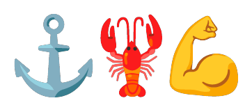

<p align="center">
  
</p>

<h1 align="center">CommandClaw Skills</h1>

<p align="center">
  <strong>Official skills repository for Command Claw agents.</strong><br>
  <sub>Skills are markdown files that describe agent capabilities — install them into any vault.</sub>
</p>

---

> [!WARNING]
> **🚧 Beta Software** — This project is under active development. Workflows and commands may be incomplete or broken. Your feedback helps make this better!
>
> 💬 **Have feedback or found a bug?** Reach out at [**@_Shikh4r_** on X](https://x.com/_Shikh4r_)

## Usage

Install skills into your CommandClaw vault:

```bash
# From your vault directory — select which skills to add
npx skills add FnSK4R17s/commandclaw-skills
```

Skills are installed into `.agents/skills/<skill-name>/SKILL.md` within your vault. The CLI will prompt you to choose which skills to install.

## Available Skills

| Skill | Description |
|-------|-------------|
| `bash` | Execute shell commands safely with timeouts and safety rules |
| `github` | GitHub operations via `gh` CLI — PRs, issues, reviews, pushes |
| `file-ops` | Read, write, and manage files in the workspace |

## Skill Format

Each skill is a directory containing a `SKILL.md` with YAML frontmatter:

```markdown
---
name: skill-name
description: One-line description of what this skill does and when to use it.
---

# Skill Name

Instructions, patterns, and rules for the agent to follow.
```

## Contributing

1. Create a new directory under `skills/` with your skill name.
2. Add a `SKILL.md` with `name` and `description` frontmatter.
3. Write clear instructions the agent can follow.
4. Open a PR.
